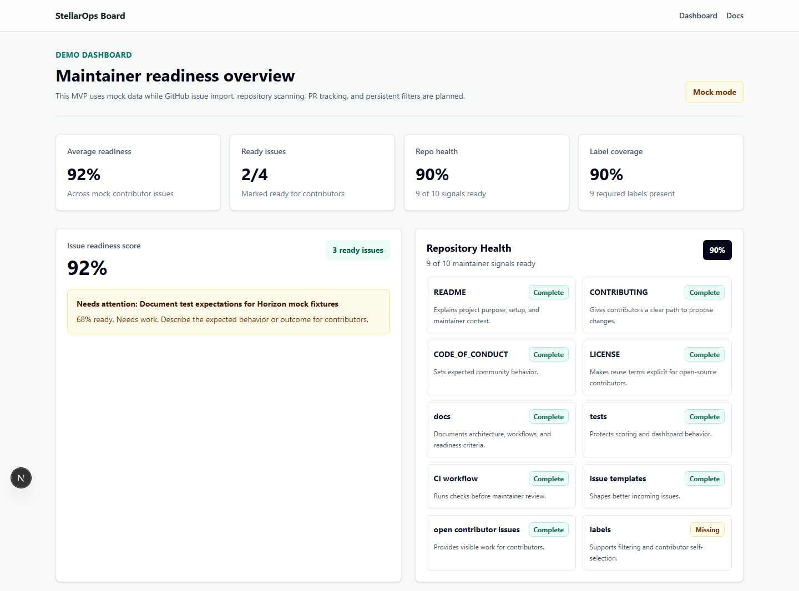
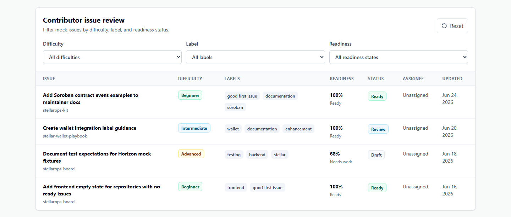
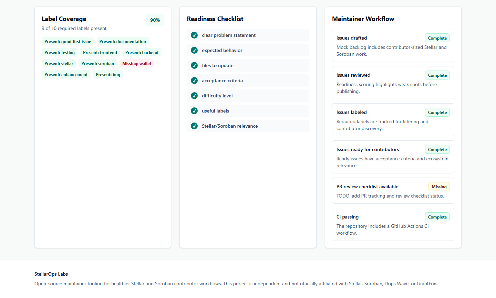
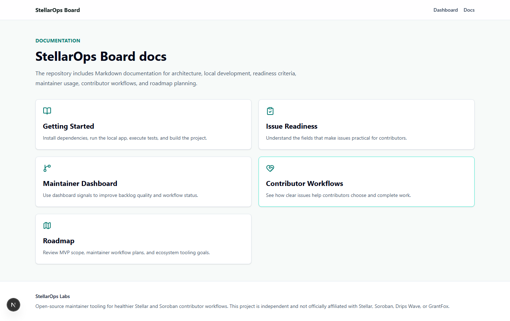

# Screenshot Guide

This page provides a visual overview of the main StellarOps Board workflows.

## Main Dashboard

The main dashboard gives contributors a quick overview of the board interface and available contribution opportunities.

## Issue Readiness View

The issue readiness view helps contributors evaluate whether an issue has enough context to start working on it.

## Filtering Workflow

The filtering workflow helps contributors narrow issues based on available project signals and readiness.

## Maintainer-Focused Sections

Maintainer-focused sections help repository owners understand how issues are presented to potential contributors.